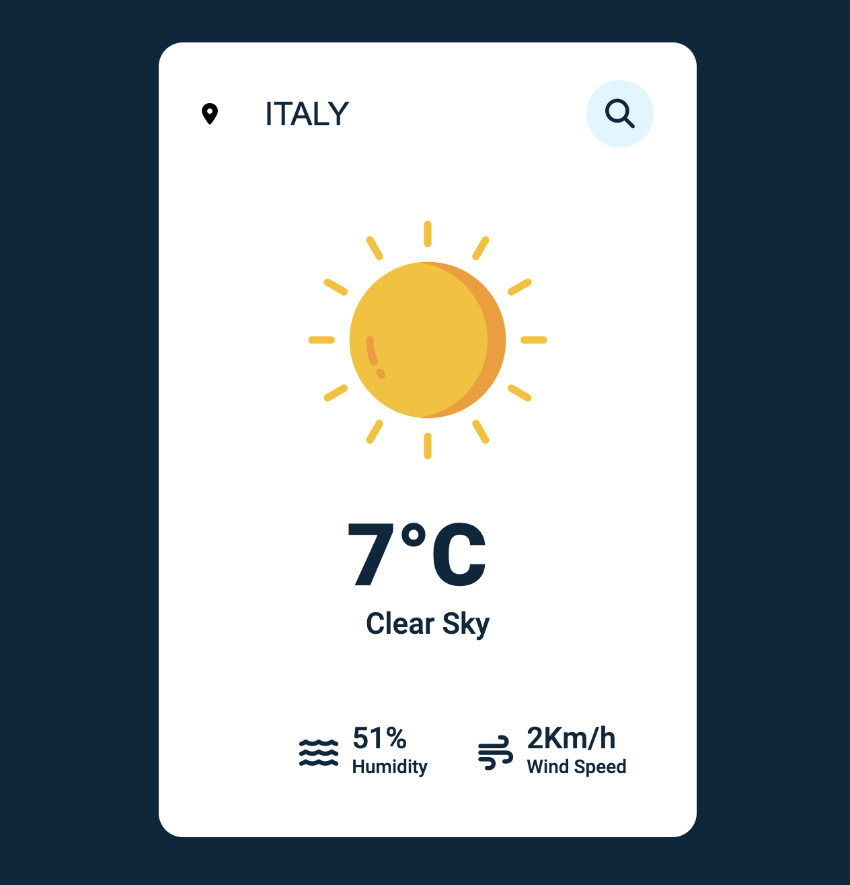

### Weather App
Practice of a weather application with javascript. Use a weather API and we get data from the API.

## Warning
You need to get your own api key https://openweathermap.org/ and replace it in index.js:

```javascript
const APIKey = 'Your Api Key';
```


# Screenshot
Here we have project screenshot :


